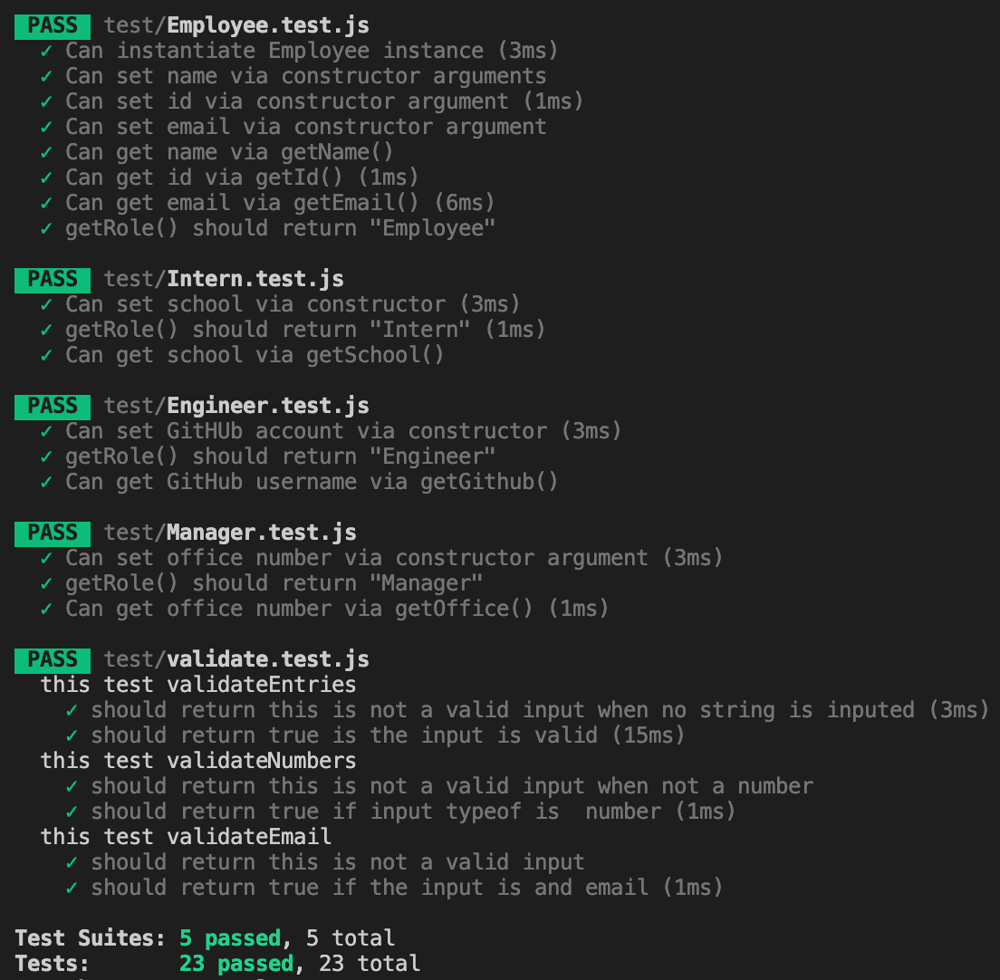

# Team Generator


## Description

Team Generator is a Node CLI that takes in information about employees and generates an HTML webpage that displays summaries for each person. 
The application will prompt the user for information about the team manager and then information about the team members. The user can input any number of team members, and they may be a mix of engineers and interns. This assignment must also pass all unit tests. When the user has completed building the team, the application will create an HTML file that displays a nicely formatted team roster based on the information provided by the user. Following the [common templates for user stories](https://en.wikipedia.org/wiki/User_story#Common_templates), we can frame this challenge as follows:

## Table of Contents

Please use the links in the table below to navigate the ReadMe contents.

- [Get Started](#get-started)
- [MVP](#MVP)
- [Installation Requirements](#installation-requirements)
- [Dependencies](#dependencies)
- [Final Output](#final-output)


## User Story
```
As a manager
I want to generate a webpage that displays my team's basic info
so that I have quick access to emails and GitHub profiles
```


* Below is a demo of what the applicatio. 


### Get Started

In the `Develop` folder, there is a `package.json`, so make sure to `npm install`.

The dependencies are, [jest](https://jestjs.io/) for running the provided tests, and [inquirer](https://www.npmjs.com/package/inquirer) for collecting input from the user.

There are also unit tests to help you build the classes necessary.

It is recommended that you follow this workflow:

1. Run tests
2. Create or update classes to pass a single test case
3. Repeat

🎗 Remember, you can run the tests at any time with `npm run test`

It is recommended that you start with a directory structure that looks like this:

```
lib/           // classes and helper code
output/        // rendered output
templates/     // HTML template(s)
test/          // jest tests
  Employee.test.js
  Engineer.test.js
  Intern.test.js
  Manager.test.js
app.js         // Runs the application
```

### MVP

* Functional application.

* GitHub repository with a unique name and a README describing the project.

* User can use the CLI to generate an HTML page that displays information about their team.

* All tests must pass.

### User input

The project must prompt the user to build an engineering team. An engineering
team consists of a manager, and any number of engineers and interns.

### Roster output

The project generates a `team.html` page in the `output` directory, that displays a nicely formatted team roster. Each team member displays the following in no particular order:

  * Name

  * Role

  * ID

  * Role-specific property (School, link to GitHub profile, or office number)


####  Installation Requirements 

- **Node.js** - Make sure Node.js is installed in your machine. If Node.js is not installed on your machine, [click here](https://nodejs.org/en/) to download the application.
- **NPM Inquirer Package** - The [NPM inquirer package](https://www.npmjs.com/package/inquirer) is needed to prompt questions in the commandline.
  - This package is already listed as a dependency in the `package.json` file, so you will only need to run the `npm install` command in your terminal to access this package.
  
#### Dependencies
  
* **Jest** - The [jest](https://jestjs.io/) is the Js testing framework that is used for unit testing in this project.
  - This dependency is already included in the `package.json` file, so you will only need to run the `npm install` command in your terminal to enable testing funcitionality.
  
* **chalk-pipe** - [chalk-pipe]https://github.com/LitoMore/chalk-pipe) is a Js styling library used for CLI interfaces. 
 - This dependency is included in the `packege.json`. All that needs to be done is run `npm install` or `npm i` for short. 

## Final Output

To compliment the demo video provided in the [Links for Submission Items](#links-for-submission-items) section, I included the screenshots below to demonstrate that (a) all applicable unit test passed and (b) the team.html file was generated based on user input to prompted questions.

### Testing

Screenshot that demonstrates all unit tests pass.




